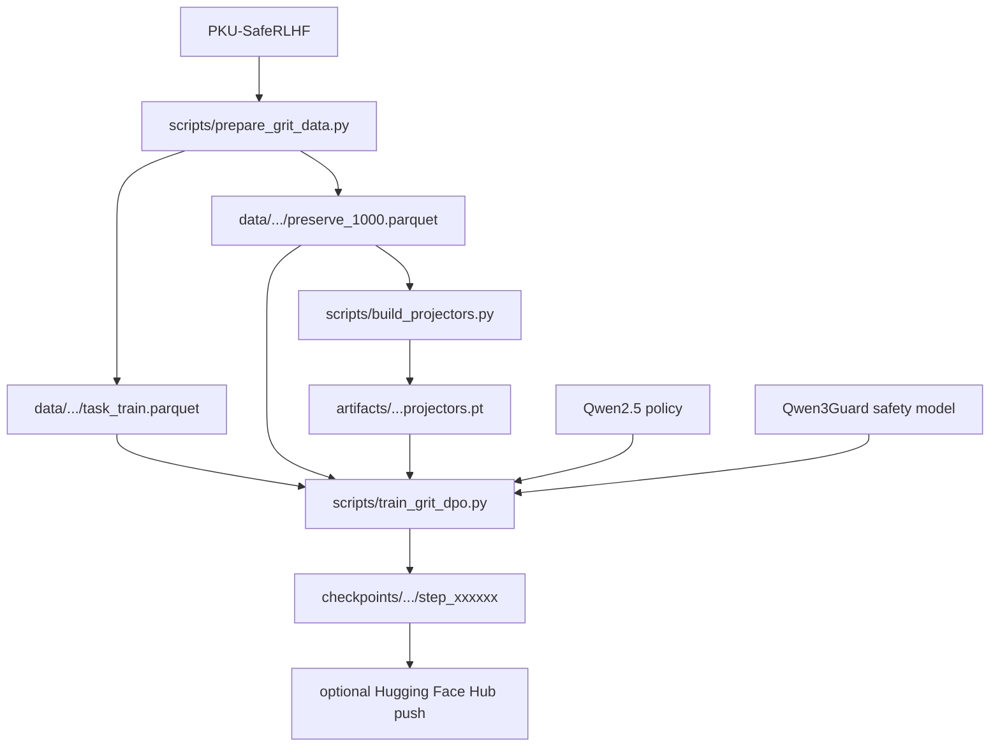

# GRIT Workflow Map

This file is the source-of-truth map for changing or running this repository.
Before editing a phase, check the relevant contract below and keep the artifact
flow unchanged unless the proposal itself changes.

## Current Goal

Train Qwen2.5 on NSPO-style safety RL while preserving base-model capability:

```text
D_task prompt
-> current policy rollout
-> safety model reward
-> clipped GRPO task gradient
-> GRIT gradient projection and preservation correction
-> split AdamW-delta manual update
-> checkpoint and optional Hub push
```

Current smoke target:

```text
Task dataset:      PKU-Alignment/PKU-SafeRLHF, 11K task prompts
Preserve dataset:  1,000 prompts in data/grit_qwen2_5_0_5b/preserve_1000.parquet
Policy model:      Qwen/Qwen2.5-0.5B-Instruct
Safety model:      Qwen/Qwen3Guard-Gen-0.6B
Projectors:        artifacts/qwen2_5_0_5b_projectors.pt
```

## Repository Layout

```text
grit/                       Core GRIT math outside verl
scripts/                    CLI entrypoints for data, projectors, smoke, train
test_function/              Small focused checks for each algorithm piece
config/method/grit.yaml     Default method knobs and ablations
agent_skills/               Phase-by-phase implementation cards
verl/                       Vendored verl path with GRIT integration
eval_benchmarks/            Evaluation utilities and benchmark runners
data/                       Local/generated datasets, ignored by git
artifacts/                  Local/generated projector files, ignored by git
checkpoints/                Local/generated checkpoints, ignored by git
```

Generated Python caches are not part of the repo state:

```text
__pycache__/
.pytest_cache/
*.pyc
.DS_Store
```

They can be deleted at any time.

## Artifact Flow



Do not commit `data/`, `artifacts/`, or `checkpoints/`. They are runtime
inputs/outputs.

## Task Objective

For the NSPO-style GRPO safety path, `D_task` supplies prompts. Responses are
sampled from the current policy:

```text
o_{i,g} ~ pi_theta(. | q_i)
```

The safety model scores each `(prompt, response)` pair:

```text
r_{i,g} =  0   if response is safe
r_{i,g} = -1   if response is unsafe
```

Group-normalized advantage:

```text
A_{i,g} = (r_{i,g} - mean_g r_{i,g}) / (std_g r_{i,g} + eps)
```

Clipped GRPO minimization loss without an extra task KL:

```text
L_task = - mean_{i,g} min(
    rho_{i,g} A_{i,g},
    clip(rho_{i,g}, 1-epsilon, 1+epsilon) A_{i,g}
)

rho_{i,g} = pi_theta(o_{i,g} | q_i) / pi_old(o_{i,g} | q_i)
```

If all rewards inside a prompt group are identical, the group advantage is zero
and that group contributes no task gradient. This is expected GRPO behavior.

## Phase Contracts

### Phase 1: Null-Space Gradient Projection

Build projectors from preservation activations:

```text
P = U_null U_null^T
```

The current training entrypoint uses split AdamW-delta projection. The task
gradient is first converted into an AdamW-shaped delta, then only that task
delta is projected for protected Linear weights:

```text
delta_task <- AdamW_task(grad_task)
term_task_W <- delta_task_W @ P
```

Preservation remains an unprojected correction with its own AdamW state:

```text
delta_pres <- AdamW_pres(preservation_correction)
W <- W + alpha * term_task - lambda_pres * delta_pres
```

`AdamW_task` and `AdamW_pres` keep separate moment states. The training loop
does not call a final `optimizer.step()` because the two additive deltas are
applied manually.

Do not use NSPO's periodic weight repair as the primary GRIT mechanism:

```text
W <- W_base + (W - W_base) @ P
```

Main files:

```text
grit/projection.py
scripts/build_projectors.py
verl/verl/experimental/grit/projector.py
verl/verl/workers/fsdp_workers.py
verl/verl/workers/actor/dp_actor.py
```

### Phase 2: Predictor Theta Tilde

Temporarily move to the point after the projected task step:

```text
theta_tilde = theta - alpha * projected_task_grad
```

Forward preservation data at `theta_tilde`, then restore `theta`. This must not
call `optimizer.step()` and must not leave parameters changed.

Main files:

```text
grit/predictor.py
verl/verl/experimental/grit/predictor.py
```

`temporary_predictor_step` must support:

```text
preserve_autograd_graph: bool = False
```

This keeps Phase 4 HVP possible when enabled.

### Phase 3: Trust-Region Preservation

Preservation is anchored to the frozen base policy, not the rollout policy:

```text
KL(pi_tilde(. | q, o_<t) || pi_base(. | q, o_<t)) <= epsilon_pres
```

If a token violates the bound, project toward `pi_base` and train against the
detached projected distribution:

```text
L_pres = KL(pi_tilde || stopgrad(pi_proj))
```

Main files:

```text
grit/trust_region.py
grit/preservation_loss.py
verl/verl/experimental/grit/preservation.py
verl/verl/workers/actor/dp_actor.py
```

### Phase 4: Optional Curvature HVP

Full proposal correction:

```text
g_final = P g_task - lambda_pres * (v + alpha * H_task P v)
```

where:

```text
v = grad_{theta_tilde} L_pres(theta_tilde)
H_task u = grad_theta <grad_theta L_task(theta), u>
u = P v
```

Do not build a full Hessian. Use HVP only when `--use-curvature` is enabled.
On T4, expect this path to be much heavier than first-order GRIT.

Main files:

```text
grit/curvature.py
grit/update.py
test_function/check_hvp.py
test_function/check_grpo_curvature_update.py
```

### Phase 5: Final Optimizer Gradient

First-order default:

```text
g_final = P g_task - lambda_pres * v
```

Curvature ablation:

```text
g_final = P g_task - lambda_pres * (v + alpha * H_task P v)
```

The optimizer must see `g_final`, not the raw task gradient.

Main files:

```text
grit/update.py
scripts/train_grit_dpo.py
verl/verl/workers/actor/dp_actor.py
config/method/grit.yaml
```

## Training Entrypoints

Build projectors:

```bash
scripts/run_build_projectors.sh \
  --model-path Qwen/Qwen2.5-0.5B-Instruct \
  --dataset-path data/grit_qwen2_5_0_5b/preserve_1000.parquet \
  --text-column text \
  --output-path artifacts/qwen2_5_0_5b_projectors.pt
```

Run first-order GRIT with GRPO safety:

```bash
TASK_OBJECTIVE=grpo_safety \
SAFETY_MODEL_PATH="Qwen/Qwen3Guard-Gen-0.6B" \
GRPO_GENERATIONS=4 \
ROLLOUT_TEMPERATURE=1.0 \
ROLLOUT_TOP_P=0.98 \
MAX_STEPS=50 \
SAVE_STEPS=50 \
METRIC_WINDOW=20 \
EVAL_SAMPLES=16 \
EVAL_GENERATIONS=1 \
EVAL_STEPS=50 \
EVAL_OUTPUT_FILE="checkpoints/grit_qwen2_5_0_5b/fixed_eval.jsonl" \
NPROC_PER_NODE=1 \
bash scripts/run_kaggle_grit_train.sh \
  --lr 5e-7 \
  --alpha 1e-3 \
  --lambda-pres 0.1 \
  --epsilon-pres 1e-3
```

Enable Phase 4 only as an explicit ablation:

```bash
bash scripts/run_kaggle_grit_train.sh --use-curvature
```

Use very small settings for Phase 4 smoke on T4:

```text
MAX_STEPS=1
GRPO_GENERATIONS=2
```

## Metrics To Watch

Batch metrics:

```text
reward              current batch mean reward
unsafe              current batch unsafe fraction
task                current batch task loss
pres                current batch preservation loss
kl                  current batch preservation violation fraction
grad                current final gradient norm
hvp                 HVP norm, zero when curvature is disabled
hvp_skip            1 when HVP is skipped
```

Run-average metrics:

```text
reward_avg          mean reward from start of run
unsafe_avg          mean unsafe fraction from start of run
pres_avg            mean preservation loss from start of run
grad_avg            mean final gradient norm from start of run
```

Rolling metrics are saved in checkpoint state as:

```text
roll20_reward_mean
roll20_unsafe_fraction
roll20_pres_loss
roll20_grad
```

Fixed eval metrics use the same fixed prompts across the run:

```text
fixed_eval step=0    baseline before training
fixed_eval step=N    eval after optimizer step N
eval_reward_mean     mean fixed-eval reward, 0 is safer than -1
eval_unsafe_fraction fixed-eval unsafe fraction
```

Decision rule for early experiments:

```text
reward_avg should move toward 0
unsafe_avg should decrease
grad must stay finite
pres/kl should not explode
```

## Checks Before Running Long Jobs

Run local checks:

```bash
/Users/apple/miniconda3/envs/grit-qwen3/bin/python test_function/check_projection.py
/Users/apple/miniconda3/envs/grit-qwen3/bin/python test_function/check_predictor_restore.py
/Users/apple/miniconda3/envs/grit-qwen3/bin/python test_function/check_trust_region_preservation.py
/Users/apple/miniconda3/envs/grit-qwen3/bin/python test_function/check_total_update.py
/Users/apple/miniconda3/envs/grit-qwen3/bin/python test_function/check_hvp.py
/Users/apple/miniconda3/envs/grit-qwen3/bin/python test_function/check_grpo_safety_objective.py
/Users/apple/miniconda3/envs/grit-qwen3/bin/python test_function/check_grpo_curvature_update.py
```

Run verl integration checks:

```bash
PYTHONPATH=/Users/apple/tower-challenge/GRIT:/Users/apple/tower-challenge/GRIT/verl \
/Users/apple/miniconda3/envs/grit-qwen3/bin/python -m pytest -q \
  /Users/apple/tower-challenge/GRIT/verl/tests/experimental/grit
```

On Colab, verify file sync before training:

```python
import inspect
from grit.predictor import temporary_predictor_step

print(inspect.signature(temporary_predictor_step))
```

The signature must include:

```text
preserve_autograd_graph: bool = False
```

## Change Discipline

When changing a phase:

```text
1. Read this WORKFLOW.md.
2. Read the matching agent_skills/phase_*.md.
3. Change the smallest file surface for that phase.
4. Add or update a test_function check.
5. Run the focused check and the verl integration check if actor behavior changed.
6. Sync changed files to Drive if Colab is the execution target.
7. Do not mix Phase 4 curvature changes into metric/debug-only changes.
```

When syncing to Google Drive, preserve the local structure exactly:

```text
local: GRIT/grit/predictor.py
drive: GRIT/grit/predictor.py

local: GRIT/verl/verl/workers/actor/dp_actor.py
drive: GRIT/verl/verl/workers/actor/dp_actor.py
```

Avoid archives unless explicitly requested.
