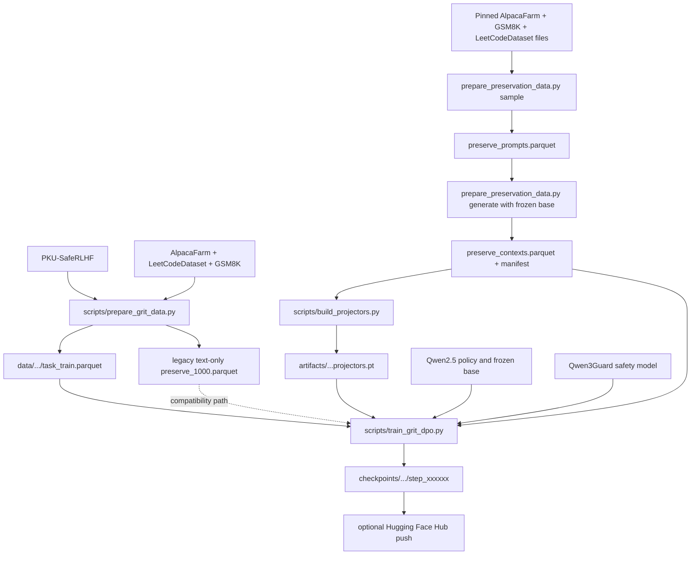

# GRIT Workflow Map

This file is the source-of-truth map for changing or running this repository.
Before editing a phase, check the relevant contract below and keep the artifact
flow unchanged unless the proposal itself changes.

## Current Goal

Train Qwen2.5 on NSPO-style safety RL while preserving base-model capability:

```text
D_task prompt
-> current policy rollout
-> safety model reward
-> clipped GRPO task gradient
-> GRIT gradient projection and preservation correction
-> one-LR manual GRIT update
-> checkpoint and optional Hub push
```

Current smoke target:

Use the explicit NSPO-domain preservation path documented in
[`docs/preservation_data.md`](docs/preservation_data.md). It samples AlpacaFarm,
GSM8K and LeetCodeDataset, generates frozen-base response contexts, and uses the
same context artifact for rebuilt projectors and response-level KL. The older
PKU-SafeRLHF text-only preservation file remains supported for compatibility, but
it is not the primary preservation artifact for this target.

```text
Task dataset:       PKU-Alignment/PKU-SafeRLHF, 11K task prompts
Preserve prompts:   334 AlpacaFarm + 333 GSM8K + 333 LeetCodeDataset
Preserve contexts:  data/preservation/qwen2_5_0_5b/preserve_contexts.parquet
Policy/base model:  Qwen/Qwen2.5-0.5B-Instruct at one pinned revision
Safety model:       Qwen/Qwen3Guard-Gen-0.6B
Projectors:         rebuilt from the generated preservation contexts
```

## Repository Layout

```text
grit/                       Core GRIT math outside verl
scripts/                    CLI entrypoints for data, projectors, smoke, train
test_function/              Small focused checks for each algorithm piece
config/method/grit.yaml     Default method knobs and ablations
config/preservation/        Pinned preservation sources, counts, and seed
agent_skills/               Phase-by-phase implementation cards
verl/                       Vendored verl path with GRIT integration
eval_benchmarks/            Evaluation utilities and benchmark runners
data/                       Local/generated datasets, ignored by git
artifacts/                  Local/generated projector files, ignored by git
checkpoints/                Local/generated checkpoints, ignored by git
```

Generated Python caches are not part of the repo state:

```text
__pycache__/
.pytest_cache/
*.pyc
.DS_Store
```

They can be deleted at any time.

## Artifact Flow



Do not commit `data/`, `artifacts/`, or `checkpoints/`. They are runtime
inputs/outputs.

### Preservation Data Contract

The reproducible NSPO-domain mix is configured in
`config/preservation/nspo_mix.json`. Its engineering defaults are seed `66` and
the `334/333/333` allocation above; they are not a claim that the exact NSPO
sample list has been reconstructed.

Preparation must satisfy all of these conditions:

```text
- Read pinned, non-evaluation source files and retain source provenance.
- Normalize and deduplicate prompts globally; fail if any domain quota is unmet.
- Refuse to overwrite an existing output directory.
- Write the final parquet and completion manifest only after a stage succeeds.
- Retain contexts.partial.jsonl when generation is interrupted; resume is not supported.
```

Frozen-base generation must use one resolved base-model revision and its chat
template. Each generated row stores exact `input_ids`, `response_start`,
`response_mask`, the base model/revision, tokenizer fingerprint, and source
metadata. Training must reject a tokenizer or base-revision mismatch and must
reject truncation that removes every response token. Preservation KL is computed
only over response tokens. The legacy text-only loader remains supported.

## Task Objective

For the NSPO-style GRPO safety path, `D_task` supplies prompts. Responses are
sampled from the current policy:

```text
o_{i,g} ~ pi_theta(. | q_i)
```

The safety model scores each `(prompt, response)` pair:

```text
r_{i,g} =  0   if response is safe
r_{i,g} = -1   if response is unsafe
```

Group-normalized advantage:

```text
A_{i,g} = (r_{i,g} - mean_g r_{i,g}) / (std_g r_{i,g} + eps)
```

Clipped GRPO minimization loss without an extra task KL:

```text
L_task = - mean_{i,g} min(
    rho_{i,g} A_{i,g},
    clip(rho_{i,g}, 1-epsilon, 1+epsilon) A_{i,g}
)

rho_{i,g} = pi_theta(o_{i,g} | q_i) / pi_old(o_{i,g} | q_i)
```

If all rewards inside a prompt group are identical, the group advantage is zero
and that group contributes no task gradient. This is expected GRPO behavior.

## Phase Contracts

### Phase 1: Null-Space Gradient Projection

Build projectors from preservation activations:

```text
P = U_null U_null^T
```

The current training entrypoint converts the task gradient into an AdamW-shaped
direction without a learning rate, then projects only that direction for
protected Linear weights:

```text
direction_task <- AdamW_direction(grad_task)
term_task_W <- direction_task_W @ P
```

Preservation remains an unprojected raw correction with no optimizer state:

```text
W <- W + lr * (term_task - lambda_pres * correction)
```

Only `AdamW_task` keeps moment state. The training loop does not call a final
`optimizer.step()` because the two additive deltas are applied manually.

Do not use NSPO's periodic weight repair as the primary GRIT mechanism:

```text
W <- W_base + (W - W_base) @ P
```

Main files:

```text
grit/projection.py
scripts/build_projectors.py
verl/verl/experimental/grit/projector.py
verl/verl/workers/fsdp_workers.py
verl/verl/workers/actor/dp_actor.py
```

### Phase 2: Predictor Theta Tilde

Temporarily move to the point after the projected task step. In the current
one-LR path this is the signed optimizer direction that will actually be applied:

```text
direction_task = AdamW_direction(grad_task)
term_task = project(direction_task)
theta_tilde = theta + lr * term_task
```

Forward preservation data at `theta_tilde`, then restore `theta`. For generated
contexts, reuse the stored token IDs and response mask rather than retokenizing
the decoded text. This must not call `optimizer.step()` and must not leave
parameters changed.

Main files:

```text
grit/predictor.py
verl/verl/experimental/grit/predictor.py
```

`temporary_predictor_step` must support:

```text
preserve_autograd_graph: bool = False
```

This keeps Phase 4 HVP possible when enabled.

### Phase 3: Trust-Region Preservation

Preservation is anchored to the frozen base policy, not the rollout policy:

```text
KL(pi_tilde(. | q, o_<t) || pi_base(. | q, o_<t)) <= epsilon_pres
```

If a token violates the bound, project toward `pi_base` and train against the
detached projected distribution:

```text
L_pres = KL(pi_tilde || stopgrad(pi_proj))
```

For generated preservation contexts, evaluate this loss only where the shifted
response mask is active. Padding and prompt tokens must never contribute to the
preservation loss. Text-only preservation data uses the legacy all-token mask.

Main files:

```text
grit/trust_region.py
grit/preservation_loss.py
verl/verl/experimental/grit/preservation.py
verl/verl/workers/actor/dp_actor.py
```

### Phase 4: Optional Curvature

Full proposal correction:

```text
preservation_correction = v - lr * H_task P v
```

where:

```text
v = grad_{theta_tilde} L_pres(theta_tilde)
H_task u = grad_theta <grad_theta L_task(theta), u>
u = P v
```

Do not build a full Hessian. Use HVP only when `--use-curvature` is enabled.
Curvature backends:

```text
exact_hvp   autograd Hessian-vector product
sam_fd      SAM-style finite difference:
            H_task u ~= (grad_task(theta + rho * u / ||u||) - grad_task(theta)) * ||u|| / rho
```

On T4, exact HVP is much heavier than first-order GRIT. `sam_fd` avoids
second-order autograd but costs one extra task-loss forward/backward.

Main files:

```text
grit/curvature.py
grit/update.py
test_function/check_hvp.py
test_function/check_grpo_curvature_update.py
```

### Phase 5: One-LR Update

First-order default:

```text
direction_task = AdamW_direction(grad_task)
term_task = project(direction_task)
W <- W + lr * (term_task - lambda_pres * v)
```

With curvature:

```text
preservation_correction = v - lr * H_task P v
W <- W + lr * (term_task - lambda_pres * preservation_correction)
```

Curvature ablation:

```text
update_direction = term_task - lambda_pres * (v - lr * H_task P v)
```

`lr` is multiplied once, after the task and preservation directions are combined.

Main files:

```text
grit/update.py
scripts/train_grit_dpo.py
verl/verl/workers/actor/dp_actor.py
config/method/grit.yaml
```

## Training Entrypoints

Prepare the pinned 1,000-prompt NSPO-domain pool:

```bash
python scripts/prepare_preservation_data.py sample
```

Generate frozen-base contexts. Start with the short smoke command in
`docs/preservation_data.md`, then run the complete artifact:

```bash
python scripts/prepare_preservation_data.py generate \
  --prompts data/preservation/nspo_mix/preserve_prompts.parquet \
  --output-dir data/preservation/qwen2_5_0_5b \
  --model-path Qwen/Qwen2.5-0.5B-Instruct \
  --max-prompt-length 2048 \
  --max-new-tokens 256
```

Use the resolved model revision recorded in the generation manifest for the
projector builder and trainer. Rebuild projectors from the generated contexts:

```bash
scripts/run_build_projectors.sh \
  --model-path Qwen/Qwen2.5-0.5B-Instruct \
  --dataset-path data/preservation/qwen2_5_0_5b/preserve_contexts.parquet \
  --text-column text \
  --max-length 2304 \
  --output-path <new-projector-artifact>
```

Run first-order GRIT with GRPO safety:

```bash
TASK_OBJECTIVE=grpo_safety \
SAFETY_MODEL_PATH="Qwen/Qwen3Guard-Gen-0.6B" \
PRESERVE_FILE="data/preservation/qwen2_5_0_5b/preserve_contexts.parquet" \
PROJECTORS_PATH="<new-projector-artifact>" \
GRPO_GENERATIONS=4 \
ROLLOUT_TEMPERATURE=1.0 \
ROLLOUT_TOP_P=0.98 \
MAX_STEPS=50 \
SAVE_STEPS=50 \
METRIC_WINDOW=20 \
EVAL_SAMPLES=16 \
EVAL_GENERATIONS=1 \
EVAL_STEPS=50 \
EVAL_OUTPUT_FILE="checkpoints/grit_qwen2_5_0_5b/fixed_eval.jsonl" \
NPROC_PER_NODE=1 \
bash scripts/run_kaggle_grit_train.sh \
  --model-revision <base_revision-from-generation-manifest> \
  --max-preserve-length 2304 \
  --lr 5e-7 \
  --lambda-pres 0.1 \
  --epsilon-pres 1e-3
```

The generated context and projector must come from the same preservation corpus,
and the policy/base revision must match the generation manifest. A 2,304-token
preservation budget can use substantially more memory than the 256-token legacy
smoke path. To exercise compatibility instead, explicitly set `PRESERVE_FILE` to
the legacy `data/grit_qwen2_5_0_5b/preserve_1000.parquet` artifact and use its
matching projectors.

Enable Phase 4 only as an explicit ablation:

```bash
bash scripts/run_kaggle_grit_train.sh --use-curvature
```

Use SAM finite-difference curvature to avoid exact second-order HVP:

```bash
CURVATURE_MODE=sam_fd SAM_RHO=0.05 bash scripts/run_kaggle_grit_train.sh --use-curvature
```

Use very small settings for Phase 4 smoke on T4:

```text
MAX_STEPS=1
GRPO_GENERATIONS=2
```

## Metrics To Watch

Batch metrics:

```text
reward              current batch mean reward
unsafe              current batch unsafe fraction
task                current batch task loss
pres                current batch preservation loss
kl                  current batch preservation violation fraction
grad                current final gradient norm
hvp                 exact or SAM-FD HVP approximation norm, zero when curvature is disabled
hvp_skip            1 when HVP is skipped
curv                curvature backend shown in tqdm: hvp or sam
```

Run-average metrics:

```text
reward_avg          mean reward from start of run
unsafe_avg          mean unsafe fraction from start of run
pres_avg            mean preservation loss from start of run
grad_avg            mean final gradient norm from start of run
```

Rolling metrics are saved in checkpoint state as:

```text
roll20_reward_mean
roll20_unsafe_fraction
roll20_pres_loss
roll20_grad
```

Fixed eval metrics use the same fixed prompts across the run:

```text
fixed_eval step=0    baseline before training
fixed_eval step=N    eval after optimizer step N
eval_reward_mean     mean fixed-eval reward, 0 is safer than -1
eval_unsafe_fraction fixed-eval unsafe fraction
```

Decision rule for early experiments:

```text
reward_avg should move toward 0
unsafe_avg should decrease
grad must stay finite
pres/kl should not explode
```

## Checks Before Running Long Jobs

Run local checks:

```bash
/Users/apple/miniconda3/envs/grit-qwen3/bin/python test_function/check_projection.py
/Users/apple/miniconda3/envs/grit-qwen3/bin/python test_function/check_preservation_data.py
/Users/apple/miniconda3/envs/grit-qwen3/bin/python test_function/check_predictor_restore.py
/Users/apple/miniconda3/envs/grit-qwen3/bin/python test_function/check_trust_region_preservation.py
/Users/apple/miniconda3/envs/grit-qwen3/bin/python test_function/check_total_update.py
/Users/apple/miniconda3/envs/grit-qwen3/bin/python test_function/check_hvp.py
/Users/apple/miniconda3/envs/grit-qwen3/bin/python test_function/check_grpo_safety_objective.py
/Users/apple/miniconda3/envs/grit-qwen3/bin/python test_function/check_grpo_curvature_update.py
```

Run verl integration checks:

```bash
PYTHONPATH=/Users/apple/tower-challenge/GRIT:/Users/apple/tower-challenge/GRIT/verl \
/Users/apple/miniconda3/envs/grit-qwen3/bin/python -m pytest -q \
  /Users/apple/tower-challenge/GRIT/verl/tests/experimental/grit
```

On Colab, verify file sync before training:

```python
import inspect
from grit.predictor import temporary_predictor_step

print(inspect.signature(temporary_predictor_step))
```

The signature must include:

```text
preserve_autograd_graph: bool = False
```

## Change Discipline

When changing a phase:

```text
1. Read this WORKFLOW.md.
2. Read the matching agent_skills/phase_*.md.
3. Change the smallest file surface for that phase.
4. Add or update a test_function check.
5. Run the focused check and the verl integration check if actor behavior changed.
6. Sync changed files to Drive if Colab is the execution target.
7. Do not mix Phase 4 curvature changes into metric/debug-only changes.
```

When syncing to Google Drive, preserve the local structure exactly:

```text
local: GRIT/grit/predictor.py
drive: GRIT/grit/predictor.py

local: GRIT/verl/verl/workers/actor/dp_actor.py
drive: GRIT/verl/verl/workers/actor/dp_actor.py
```

Avoid archives unless explicitly requested.
