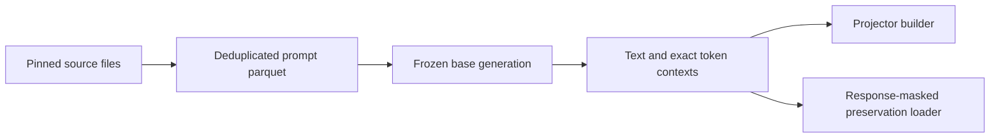

# Preservation data implementation

## Requirements and authorization

The user approved AlpacaFarm, GSM8K and LeetCodeDataset for preservation after
reviewing their relationship to NSPO. Implement the previously discussed sampling,
base-response generation, provenance and response-mask integration. The 334/333/333
allocation and seed 66 are engineering defaults, not a claimed NSPO reproduction.

- When preparing prompts, use pinned non-evaluation source files, deduplicate
  normalized prompts and produce exactly the requested per-domain counts.
- When generating contexts, use a fixed base model/revision and its chat template;
  save exact token IDs and the generated-response boundary.
- When training on generated contexts, preserve response-token masking, reject
  tokenizer mismatches and reject truncation that removes every response token.
- Keep legacy text-only input supported. Generated artifacts remain ignored.

## Design

One preparation CLI has two stages: sample prompts, then generate frozen-base
responses. A small shared data helper formats sources and pads stored contexts.
The existing standalone trainer reads stored contexts when present.

| Approach | Benefit | Cost | Decision |
|---|---|---|---|
| Reuse task preparation | Existing entry point | Reloads and rewrites unrelated task data | No |
| Separate preservation CLI | Independent, reproducible artifact | One additional CLI | Yes |

| Edge case / exception | Behavior |
|---|---|
| Duplicate/empty prompt | Skip; fail if requested quota cannot be reached |
| Network failure | Fail with original exception; no completed manifest |
| Existing output directory | Refuse overwrite |
| Generation interruption | Preserve partial JSONL; no completed parquet/manifest |
| Invalid stored tokens/mask or tokenizer mismatch | Fail before training |
| Context exceeds training length | Truncate consistently; fail if no response remains |

Each stage creates a new output directory exclusively, so concurrent writers cannot
claim the same output. Final manifest is written only after artifacts succeed.

## Execution and validation

1. Add source configuration, preparation CLI, and shared data helpers.
   Verify source formatting, counts, determinism, unique IDs and provenance.
2. Add frozen-base generation and stored-token loader integration.
   Verify response masks, padding, tokenizer identity and truncation using fixtures.
3. Prepare the real 1,000-prompt artifact and verify it independently.
4. Document generation/projector/training commands and review the final diff.

Scope: `config/preservation/`, `scripts/prepare_preservation_data.py`,
`scripts/preservation_data.py`, `scripts/train_grit_dpo.py`, focused tests and
preservation documentation. No optimizer or trust-region math changes.

Local runtime initially has MSYS Python without torch/datasets/pyarrow/transformers.
Use an isolated local runtime if needed. Report real-data and model-generation
validation separately; do not claim generation ran based on fixture tests.
